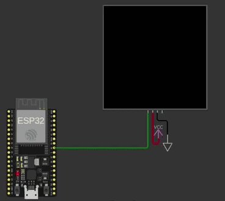

# Conway’s Game of Life on an LEDs Matrix (WS2812B)

ESP32 FreeRTOS firmware that runs Conway’s Game of Life on a 24×24 LEDs matrix (WS2812B).

You can check live simulation on [wokiwi.com](https://wokwi.com/projects/473868331969340417)