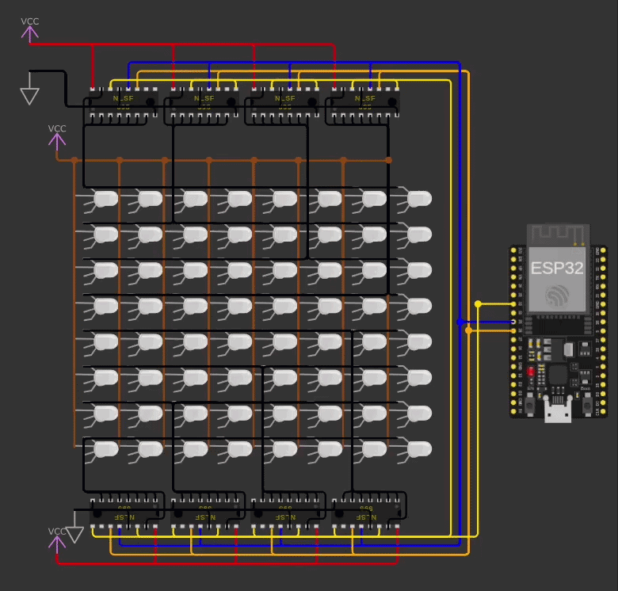

# Conway’s Game of Life on an LED Matrix (controlled by NLSF595)

ESP32 firmware that runs Conway’s Game of Life on a 8×8 LEDs matrix controlled by NLSF595.

You can check live simulation on [wokiwi.com](https://wokwi.com/projects/474166527428564993)